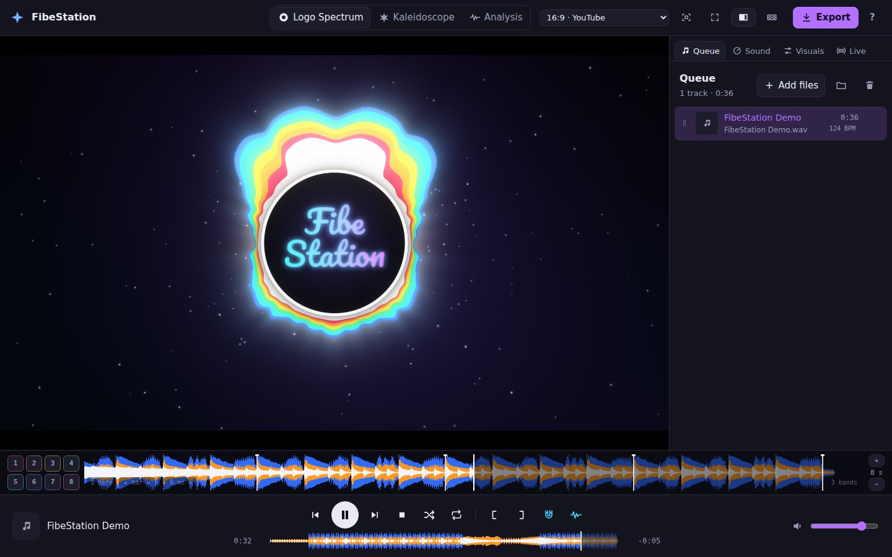
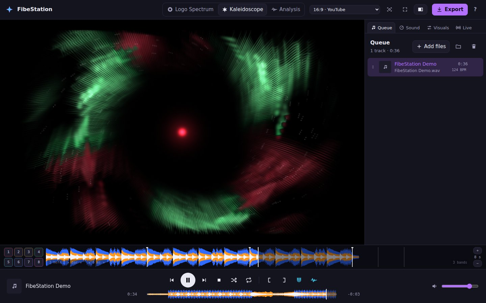
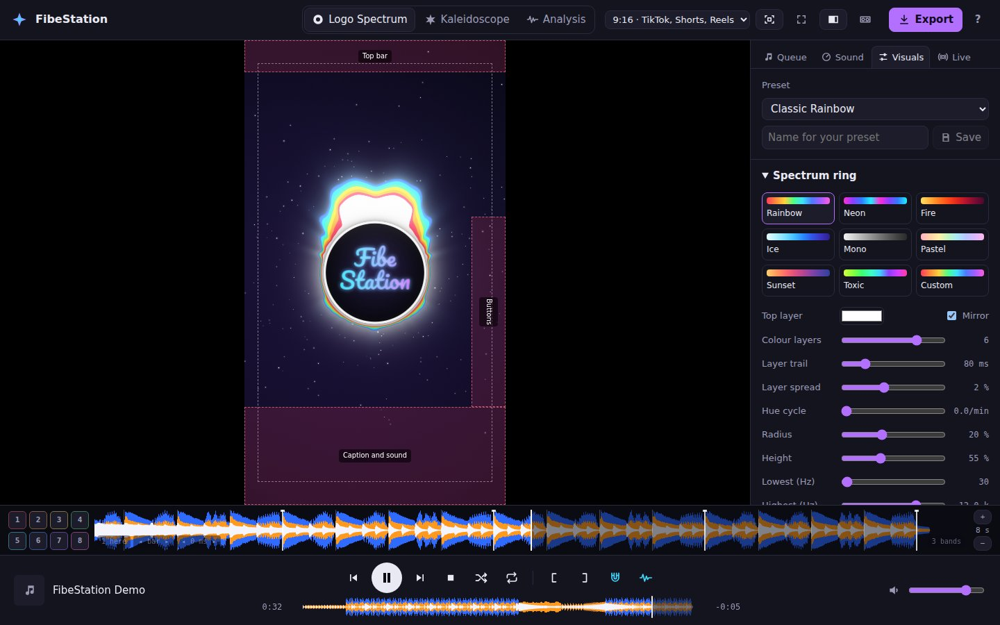
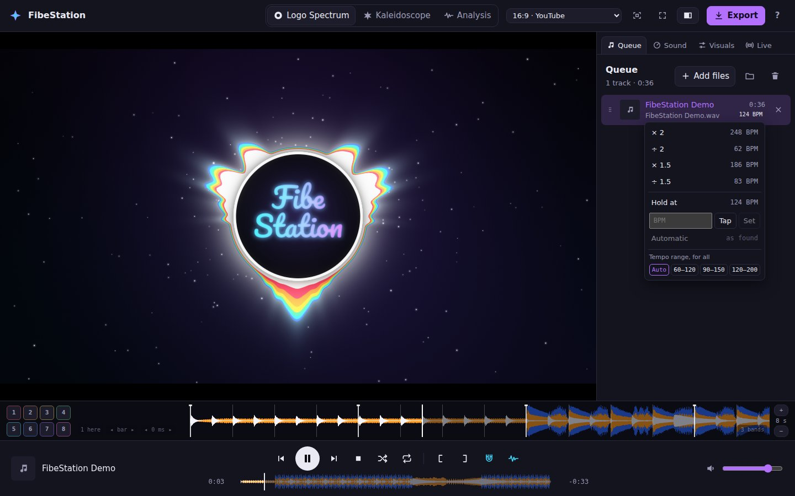
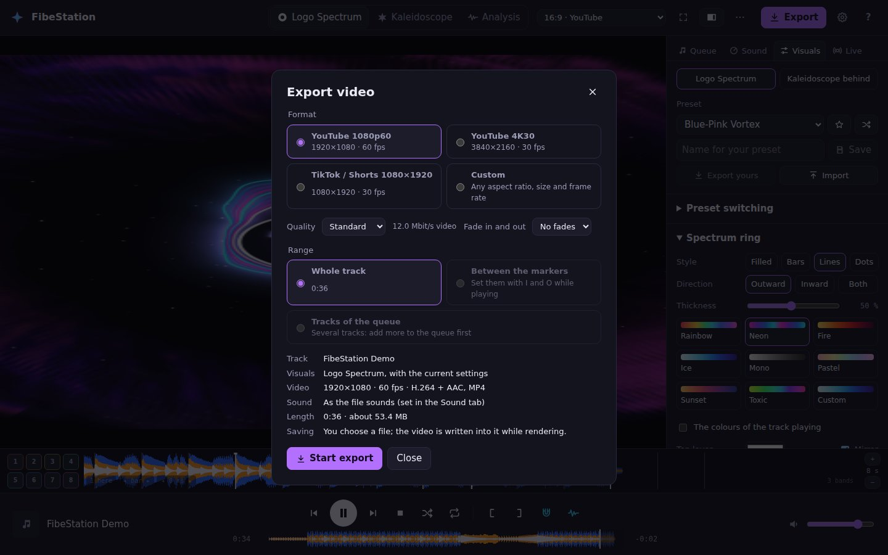
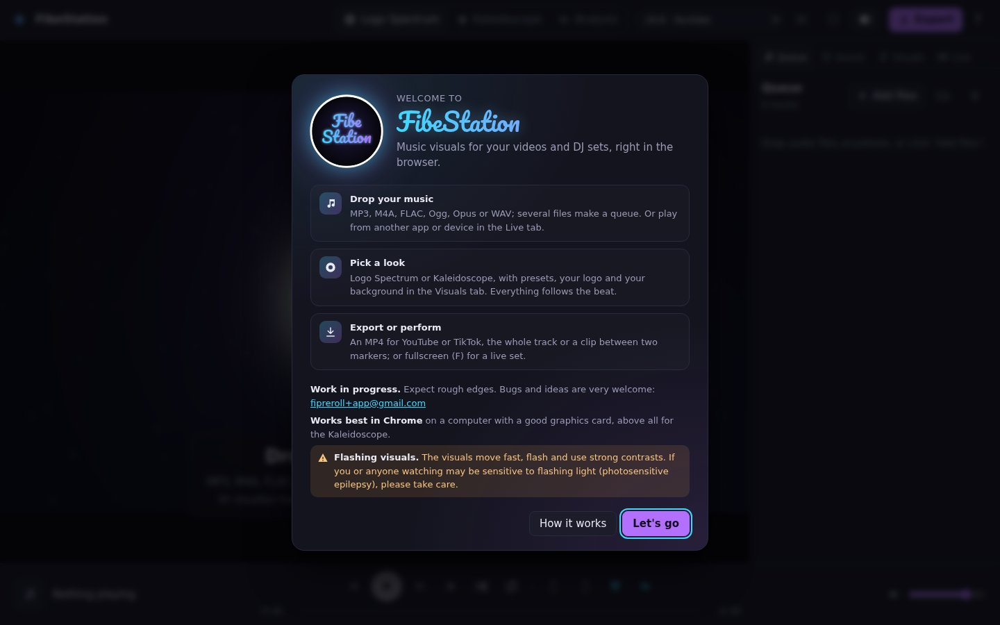

# Vibe Visualizer

The app calls itself **FibeStation**; double-click the name in the top bar to give it another one.

Audio-reactive music visualizer in the browser: kaleidoscopic shader scenes and logo-centred spectrum visuals, watched live or rendered offline into HD videos for YouTube and TikTok. Everything runs locally: no server, no uploads.

**Try it:** [fibestation.fipreroll.workers.dev](https://fibestation.fipreroll.workers.dev), best in Chrome or Edge.



> **Status:** P1 to P5 are done: audio engine, queue and transport, analysis with drum detection and beat tracking, the Logo Spectrum and Kaleidoscope modes, the video export (whole tracks or clips, in segments that survive a crash), live input from audio devices and other apps, tempo (vinyl and key lock) and effects (DJ filter, delay, reverb, one-click "Slowed + Reverb", "Sped up" and "Nightcore"), waveforms and hot cues, a beat grid for files, gapless playback with shuffle and repeat, folders, a queue that survives reloads, A/V sync calibration and a shortcut overview, and a usability pass (play ranges, snapping to the beat, undo, bars and tempo correction in the beat grid, two waveform styles, one tempo and a straight grid per track, tempo ranges, grid correction by hand, the tempo of live input, a welcome and in-app help), DJ controllers (the DDJ-FLX2's deck 1), and P4's visual depth and video polish (ring styles, camera shake, drift and tint, presets that switch by themselves, the Neon Ribbons scene, the Kaleidoscope behind the Logo Spectrum, reduce flashing and auto-quality, the track's title, progress and cover art on screen, the playlist as one video with chapters and fades, a video of each track, and thumbnails), and a polish after feedback (a logo that spins like a record, the Kaleidoscope behind with a look of its own and presets for it, bar switching through breaks, and a backup of all settings). What comes next is open: see the roadmap in [FEATURES.md](docs/FEATURES.md#5-roadmap-proposal).
> Plans: [feature list](docs/FEATURES.md) · [tech stack](docs/TECH-STACK.md) · [audio analysis](docs/ANALYSIS.md) · [DJ controllers](docs/CONTROLLERS.md)

## What it does

- **Two looks that follow the beat:** *Logo Spectrum* (your logo in a glowing spectrum ring, filled or of bars, lines or dots, with star particles, a background image and a camera that shakes on kicks) and *Kaleidoscope* (feedback tunnels folded into mirrored segments, and neon tubes weaving around the centre), each with presets that can switch by themselves with the music, in exports too, and every setting at hand; the Kaleidoscope can also run behind the Logo Spectrum. Over both, the title and artist of the track playing, with its progress, and its cover art as the logo.
- **Videos for YouTube and TikTok:** MP4 in 1080p60, 4K30 or 1080×1920, of a whole track, a clip between two markers, or several tracks of the queue: as one video with chapters for YouTube, or a video of each. With fades if you like, rendered frame by frame (smooth on any machine) and resumable after a crash. A click saves the picture on the stage as a thumbnail.
- **A player made for DJs:** a gapless queue, waveforms and eight hot cues per track, a beat grid with bars that you can correct (tempo, downbeat, phase), tempo with vinyl or key lock, a DJ filter, delay, reverb and one-click "Slowed + Reverb".
- **Live input:** visualises music from a DJ mixer, an audio interface, another app or a browser tab.
- **DJ controller:** play, cue, set hot cues, filter and change the tempo from a Pioneer DJ DDJ-FLX2 (Web MIDI), with its lights.
- **Private:** everything runs in the browser; no server, no uploads. A backup file takes your settings, presets, cues and images to another browser.

**How to use it:** see the [user guide](docs/USER-GUIDE.md). The same guide opens in the app: click **?** in the top bar (or press ? for the keyboard shortcuts).

## Screenshots

| | |
|---|---|
|  *Kaleidoscope:* the Vortex scene |  *9:16 for TikTok,* with the safe areas and the Visuals tab |
|  *Tempo:* double, halve, hold, type or tap it |  *Export:* YouTube, 4K or TikTok, a track or a clip |
|  *The welcome* at the first start | |

The screenshots are taken in the app with a synthetic track (`pnpm screenshots`). On GitHub, the *Screenshots* workflow (Actions → Screenshots → Run workflow) takes them again and commits them to the branch it runs on.

## Run it locally

Requirements: Node.js 22.13 or newer (24 recommended) and pnpm (`corepack enable` installs it).

```sh
pnpm install
pnpm dev
```

Then open http://localhost:5173 in Chrome or Firefox. The dev server sends the cross-origin isolation headers the audio engine needs.

## Scripts

| Command | What it does |
|---|---|
| `pnpm dev` | Development server |
| `pnpm build`, `pnpm preview` | Production build, and serving it on port 4173 |
| `pnpm check` | Type check (Svelte and TypeScript) |
| `pnpm lint`, `pnpm format` | ESLint, Prettier |
| `pnpm test` | Unit tests (Vitest) |
| `pnpm test:e2e` | End-to-end tests in Chromium (Playwright) |
| `pnpm test:e2e:firefox` | The main paths in Firefox, the end-to-end tests tagged `@firefox` |
| `pnpm test:soak` | The soak test: plays for 30 minutes (`SOAK_MINUTES`), and the memory must stay flat |
| `pnpm screenshots` | The README screenshots (docs/screenshots), taken in the app while a synthetic track plays |
| `pnpm eval:drums` | Drum detection, beat tracking and beat grid scores on real recordings (needs the MDB Drums dataset), and the beat grid on your own electronic tracks (`EDM_DIR`); see [ANALYSIS.md](docs/ANALYSIS.md#5-evaluation) |

## Hosting

The app is a static site, hosted on Cloudflare Workers as static assets (`wrangler.jsonc`): `main` is live at https://fibestation.fipreroll.workers.dev, and every other branch gets a Preview at `https://<branch>-fibestation.fipreroll.workers.dev`. In the Worker's build settings (Workers Builds):

| Setting | Value |
|---|---|
| Build command | `pnpm build` |
| Deploy command (production branch) | `npx wrangler deploy` |
| Preview command (other branches, with preview builds on) | `npx wrangler preview` |
| Root directory | `/` |

The Worker's name in the dashboard must match `name` in `wrangler.jsonc`. Wrangler is a dev dependency, so `npx wrangler` takes the version in the lockfile. `public/_headers` sets the cross-origin isolation headers that the audio engine needs (GitHub Pages cannot send them) and a content security policy; the preview server sends the same headers.

## Project layout

```
src/core/       framework-free core: audio engine (media worker, AudioWorklet, resampler, ring
                buffer, live input), sound chain (tempo, filter, delay, reverb, limiter),
                analysis (live, and per file: waveform and beat grid), library (fingerprints,
                analysis cache, folders, stored queue), WebGL2 renderer (render worker, Logo
                Spectrum and Kaleidoscope scenes), export (export worker, formats, job
                storage), player (play order) and state, Signalsmith Stretch binding, utilities
src/ui/         Svelte app: top bar, stage, queue, sound, visuals and live panels, transport
                with waveforms and cues, export, sync, welcome and help dialogs
packages/       dj-controllers: library for DJ controllers (Web MIDI, profiles, lights)
vite-plugins/   build-time extraction of the Signalsmith Stretch WebAssembly core, the build's
                name (version.json), the production headers for the preview server
tests/e2e/      Playwright tests
tests/eval/     analysis evaluation on real recordings
tests/screenshots/
                the README screenshots (pnpm screenshots)
docs/           user guide (also the in-app help), feature list, tech stack, audio analysis,
                DJ controller proposal, screenshots
```
