# Vibe Visualizer

[](https://codecov.io/gh/FionaPreroll/vibe-visualizer)

The app calls itself **FibeStation**; give it another name in **Settings** (the gear in the top bar), or double-click the name there.

Audio-reactive music visualizer in the browser: kaleidoscopic shader scenes and logo-centred spectrum visuals, watched live or rendered offline into HD videos for YouTube and TikTok. Everything runs locally: no server, no uploads.

**Try it:** [fibestation.fipreroll.workers.dev](https://fibestation.fipreroll.workers.dev), best in Chrome or Edge.


> **Status:** version 0.9, on the way to 1.0. The planned phases are done (P1 to P5: the player, the analysis, both looks, the video export, live input, tempo and effects), and so are the usability passes and DJ controllers. Now the app is being stabilized for its release: it recovers from errors by itself, its main paths are tested in Chrome and Firefox, and it has a version, a changelog, the licences of the parts of others and a privacy policy. Next come the first testers, then 1.0. What changed is in [CHANGELOG.md](CHANGELOG.md), what is planned in the roadmap of [FEATURES.md](docs/FEATURES.md#5-roadmap-proposal).
> Plans: [feature list](docs/FEATURES.md) · [tech stack](docs/TECH-STACK.md) · [audio analysis](docs/ANALYSIS.md) · [DJ controllers](docs/CONTROLLERS.md)

## What it does

- **Two looks that follow the beat:** *Logo Spectrum* (your logo in a glowing spectrum ring, filled or of bars, lines or dots, with star particles, a background image and a camera that shakes on kicks) and *Kaleidoscope* (feedback tunnels folded into mirrored segments, and neon tubes weaving around the centre), each with presets that can switch by themselves with the music, in exports too, and every setting at hand; the Kaleidoscope can also run behind the Logo Spectrum. Over both, the title and artist of the track playing, with its progress, and its cover art (or one of your own) as the logo; the visuals can take the colours of the cover, or colours set for the track, too.
- **Videos for YouTube and TikTok:** MP4 in 1080p60, 4K30 or 1080×1920, of a whole track, a clip between two markers, or several tracks of the queue: as one video with chapters for YouTube, or a video of each. With fades if you like, rendered frame by frame (smooth on any machine) and resumable after a crash. A click saves the picture on the stage as a thumbnail.
- **A player made for DJs:** a gapless queue, waveforms and eight hot cues per track, a beat grid with bars that you can correct (tempo, downbeat, phase), tempo with vinyl or key lock, a DJ filter, delay, reverb and one-click "Slowed + Reverb".
- **Live input:** visualises music from a DJ mixer, an audio interface, another app or a browser tab.
- **Mini player:** the visuals in a small window that stays on top while you work in other tabs and apps, with play, pause and skip (Chrome, Edge and Firefox; Safari has none).
- **Second screen:** the visuals in a window of their own for a projector, in fullscreen there, while you play from the tab.
- **DJ controller:** play, cue, set hot cues, filter and change the tempo from a Pioneer DJ DDJ-FLX2 (Web MIDI), with its lights; other MIDI controllers can be taught (MIDI learn), and a report of one sent to us so it can come with the app.
- **Private:** everything runs in the browser; no server, no uploads. A backup file takes your settings, presets, cues and images to another browser.

**How to use it:** see the [user guide](docs/USER-GUIDE.md). The same guide opens in the app: click **?** in the top bar (or press ? for the keyboard shortcuts).

**Bugs and ideas:** [open an issue](https://github.com/FionaPreroll/vibe-visualizer/issues/new/choose), with a form for each, or write to fipreroll+app@gmail.com (**Report a bug** in the app's help fills in the version and the browser).

## Screenshots

| | |
|---|---|
|  *Kaleidoscope:* the Vortex scene | 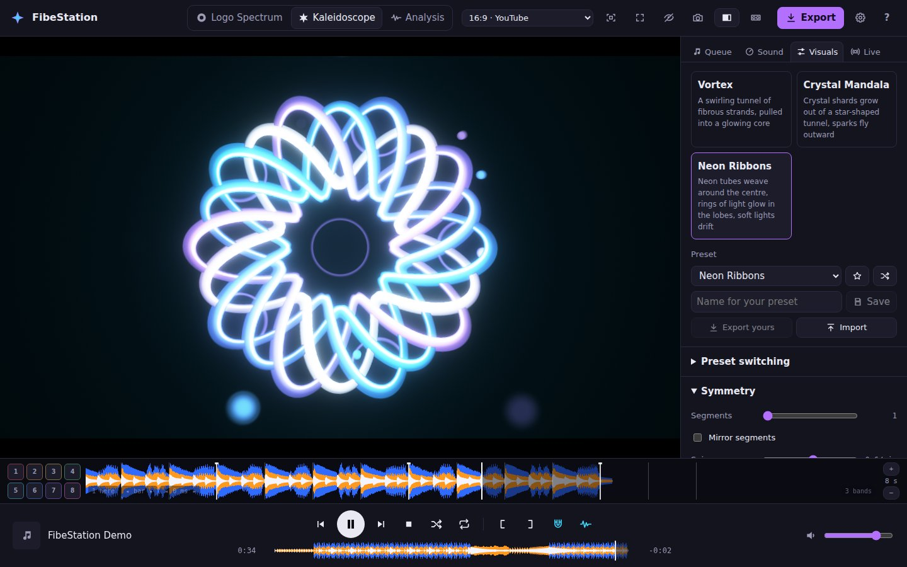 *Neon Ribbons:* tubes of light, rings and soft lights |
| 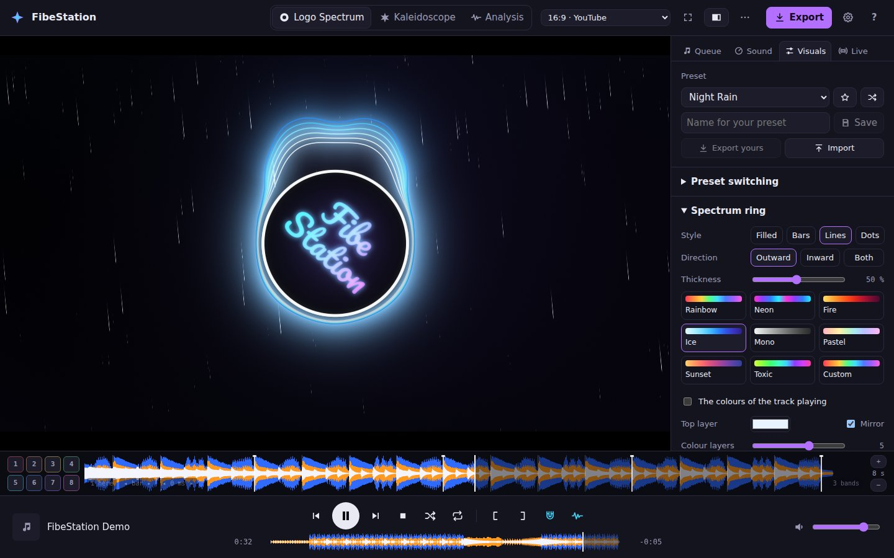 *Rain* instead of stars, in a wind |  *9:16 for TikTok,* with the safe areas and the Visuals tab |
|  *Tempo:* double, halve, hold, type or tap it | 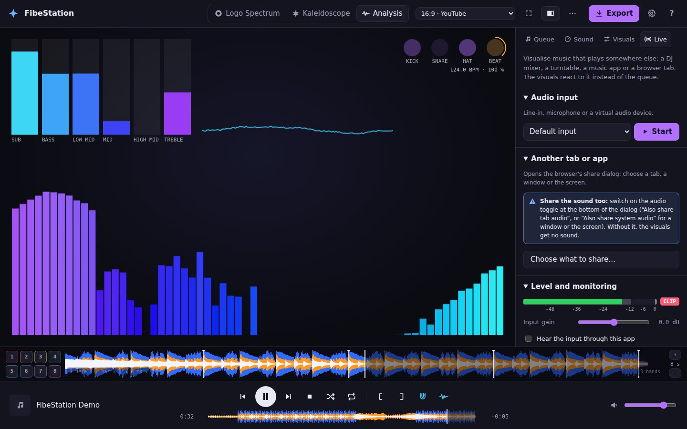 *Analysis:* what the visuals react to |
| 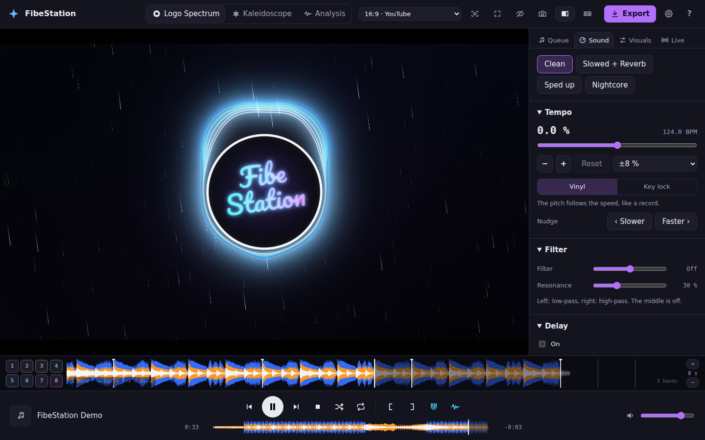 *Sound:* tempo, filter, delay, reverb, Slowed + Reverb | 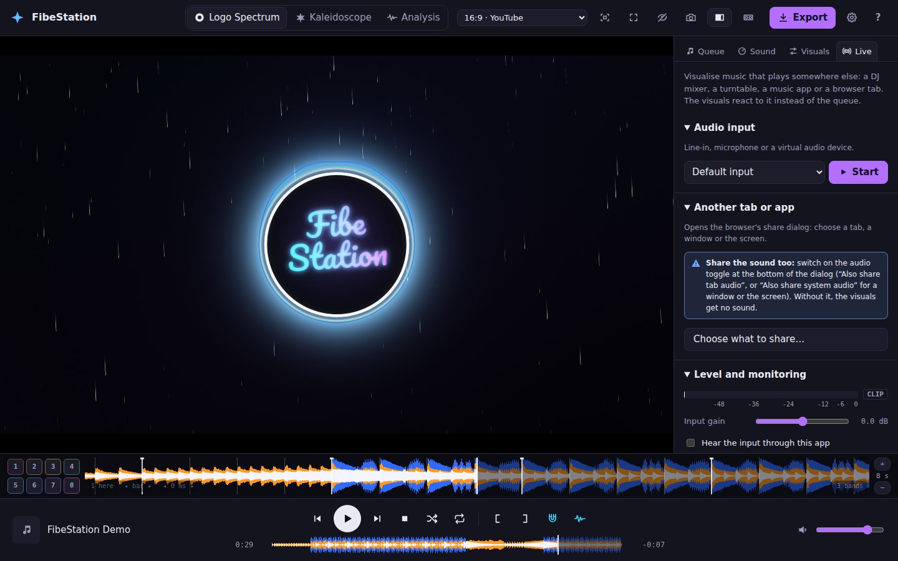 *Live:* a mixer, an interface or a browser tab |
| 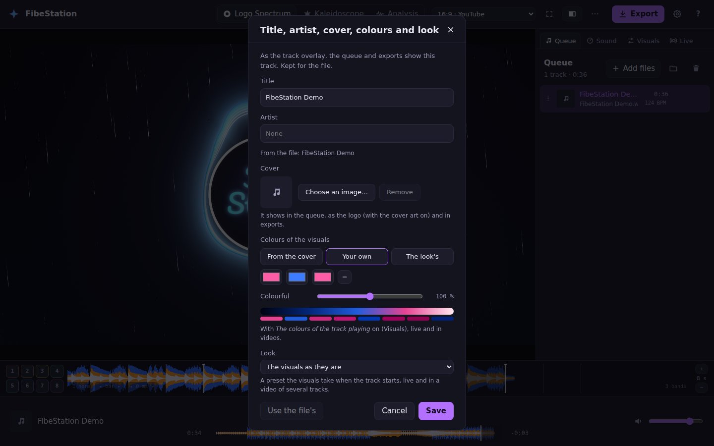 *A track's own* title, cover and colours | 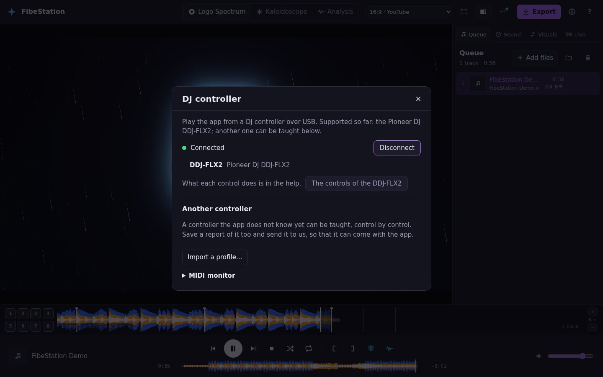 *DJ controller:* a DDJ-FLX2, connected |
|  *Export:* YouTube, 4K or TikTok, a track or a clip | 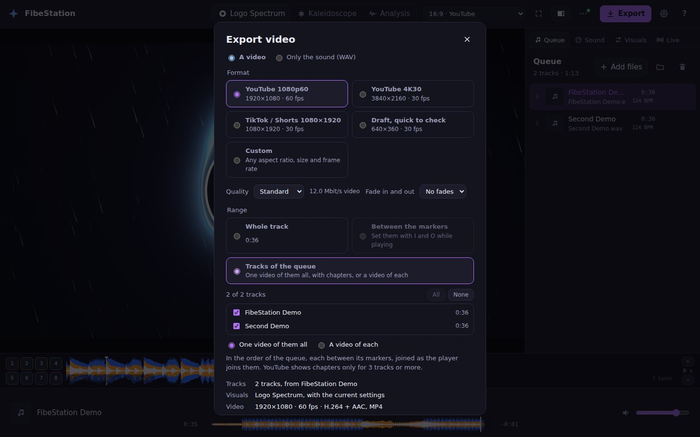 *The queue as one video,* with chapters |
| 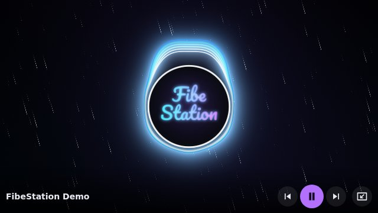 *Mini player:* on top of other tabs and apps | 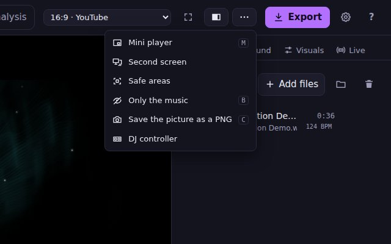 *⋯ in the top bar:* the mini player, safe areas, only the music, a PNG, the DJ controller |
|  *The welcome* at the first start | |

**The top bar** fits narrower windows: below 1360 pixels the aspect ratio leaves out its platforms and a running export shows only its progress, below 1120 the modes show only their icons, and below 820 the logo shows without the app's name.

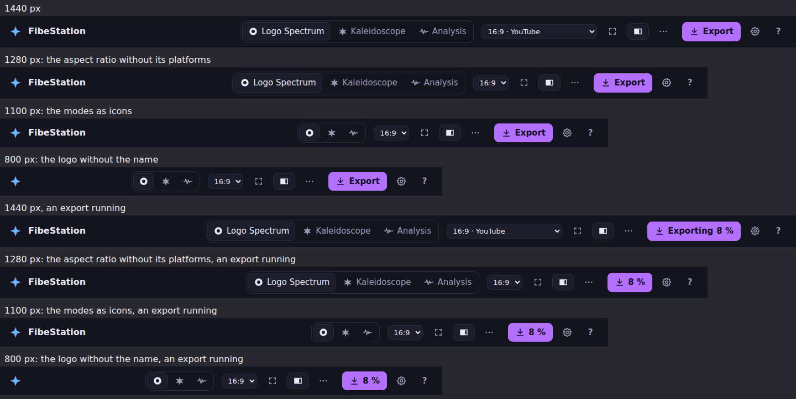

The screenshots are taken in the app with a synthetic track (`pnpm screenshots`). On GitHub, the *Screenshots* workflow (Actions → Screenshots → Run workflow) takes them again and commits them to the branch it runs on: run it on `dev`, since `main` takes changes only through pull requests.

## Run it locally

Requirements: Node.js 22.13 or newer (24 recommended) and pnpm (`corepack enable` installs it).

```sh
pnpm install
pnpm dev
```

Then open http://localhost:5173 in Chrome or Firefox. The dev server sends the cross-origin isolation headers the audio engine needs.

## Scripts

| Command | What it does |
|---|---|
| `pnpm dev` | Development server |
| `pnpm build`, `pnpm preview` | Production build, and serving it on port 4173 |
| `pnpm check` | Type check (Svelte and TypeScript) |
| `pnpm lint`, `pnpm format` | ESLint, Prettier |
| `pnpm test` | Unit tests (Vitest) |
| `pnpm test:coverage` | Unit tests with their coverage (`coverage/lcov.info`; CI sends it to Codecov for the badge) |
| `pnpm test:e2e` | End-to-end tests in Chromium (Playwright) |
| `pnpm test:e2e:firefox` | The main paths in Firefox, the end-to-end tests tagged `@firefox` |
| `pnpm test:soak` | The soak test: plays for 30 minutes (`SOAK_MINUTES`), and the memory must stay flat |
| `pnpm screenshots` | The README screenshots (docs/screenshots), taken in the app while a synthetic track plays |
| `pnpm eval:drums` | Drum detection, beat tracking and beat grid scores on real recordings (needs the MDB Drums dataset), and the beat grid on your own electronic tracks (`EDM_DIR`); see [ANALYSIS.md](docs/ANALYSIS.md#5-evaluation) |

## Hosting

The app is a static site, hosted on Cloudflare Workers as static assets (`wrangler.jsonc`): `main` is live at https://fibestation.fipreroll.workers.dev, and every other branch gets a Preview at `https://<branch>-fibestation.fipreroll.workers.dev`. In the Worker's build settings (Workers Builds):

| Setting | Value |
|---|---|
| Build command | `pnpm build` |
| Deploy command (production branch) | `npx wrangler deploy` |
| Preview command (other branches, with preview builds on) | `npx wrangler preview` |
| Root directory | `/` |

The Worker's name in the dashboard must match `name` in `wrangler.jsonc`. Wrangler is a dev dependency, so `npx wrangler` takes the version in the lockfile. `public/_headers` sets the cross-origin isolation headers that the audio engine needs (GitHub Pages cannot send them) and a content security policy; the preview server sends the same headers.

## Project layout

```
src/core/       framework-free core: audio engine (media worker, AudioWorklet, resampler, ring
                buffer, live input), sound chain (tempo, filter, delay, reverb, limiter),
                analysis (live, and per file: waveform and beat grid), library (fingerprints,
                analysis cache, folders, stored queue), WebGL2 renderer (render worker, Logo
                Spectrum and Kaleidoscope scenes), export (export worker, formats, job
                storage), player (play order) and state, Signalsmith Stretch binding, utilities
src/ui/         Svelte app: top bar, stage, queue, sound, visuals and live panels, transport
                with waveforms and cues, export, sync, settings, welcome and help dialogs
packages/       dj-controllers: library for DJ controllers (Web MIDI, profiles, lights)
vite-plugins/   build-time extraction of the Signalsmith Stretch WebAssembly core, the build's
                name and version (version.json), the parts of others with their licences
                (licenses.json, licenses.txt), the production headers for the preview server
licenses/       licence texts that the packages do not ship themselves
tests/e2e/      Playwright tests
tests/eval/     analysis evaluation on real recordings
tests/screenshots/
                the README screenshots (pnpm screenshots)
docs/           user guide (also the in-app help), feature list, tech stack, audio analysis,
                DJ controller proposal, screenshots
```

## Changelog

[CHANGELOG.md](CHANGELOG.md) says what changed, by day, newest first; the help shows it under **What's new**. Each pull request adds what users notice to it. Until 1.0 the version is 0.9 with the day and the time of the build (UTC), as About shows it.

## Licence

None yet: all rights reserved. The parts of others in the app keep their own licences; the build lists them with their texts in `licenses.txt`, and the app shows them under **Help → Licences**.

## Privacy

[PRIVACY.md](PRIVACY.md) says what the app keeps and what goes over the network: everything stays in the browser, and the app connects only to its own site, which Cloudflare hosts. The app shows it under **Help → Privacy**.
